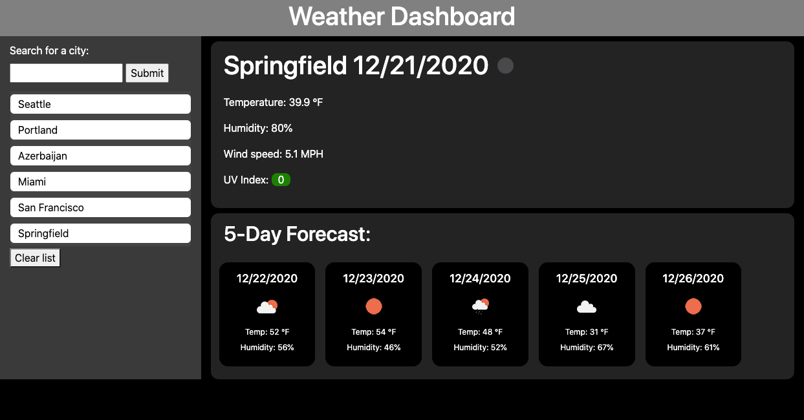

# Weather Dashboard
Weather dashboard using OpenWeatherMap API. Built for UW's 12-week coding bootcamp.

# About the author

Timothy M. Keller is a web developer and musician residing in Seattle, WA.

Email: timothy.m.keller@gmail.com

Github: https://github.com/tmkeller

LinkedIn: https://linkedin.com/in/tim-keller-3ab55bb1/

# Features

Weather dashboard using the OpenWeatherMap API. Displays weather information for user-selected cities, as well as a forecast. This web app has the following features:

* Temperature, humidity, wind speed, and UV index display, complete with a variable background for the UV display to indicate the hazardousness of prolonged time outdoors.
* Icons to show cloudiness make it easy to tell basic weather conditions at a glance.
* 5-day forecast displays temp, humidity, and cloudiness icon for as far as 5-days in advance.
* Sidebar allows user to add their custom cities, and maintains user choices persistently between sessions using localStorage.
* Responsive design looks good on desktop, tablet, and mobile.
* Built with JQuery, Javascript, Bootstrap, and OpenWeatherMap API.

## Product

[Live Site URL](https://tmkeller.github.io/weather-dashboard/)

## Technologies

## License

[CC0 1.0 Universal](https://creativecommons.org/publicdomain/zero/1.0/)
